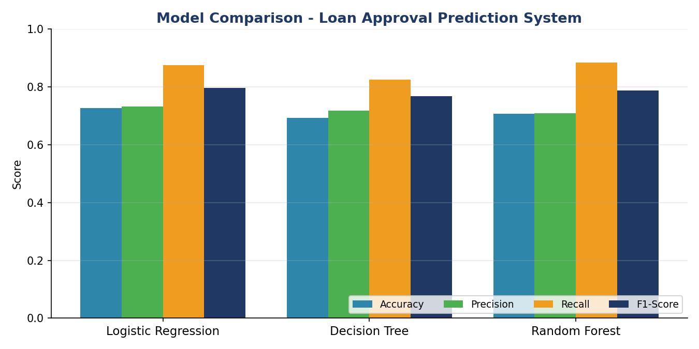
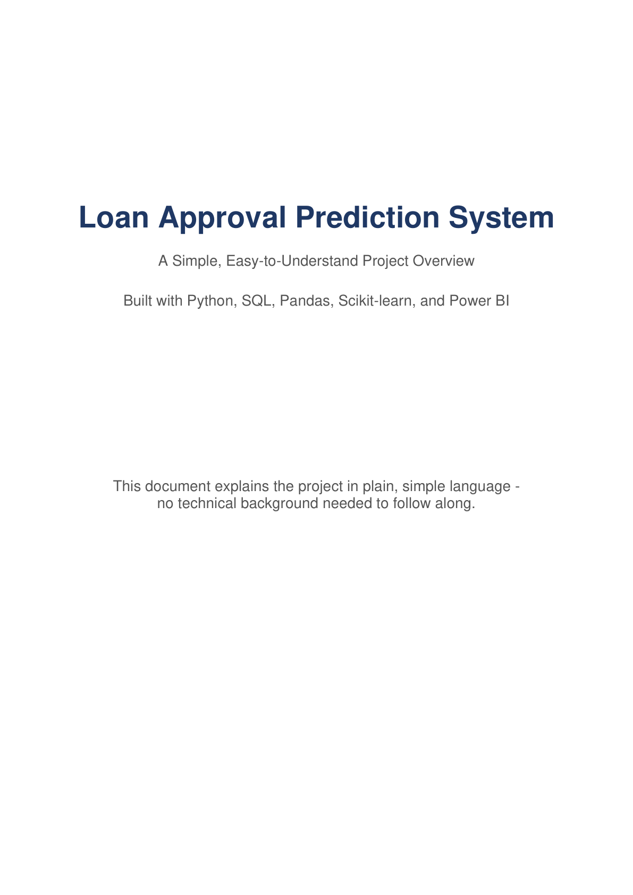
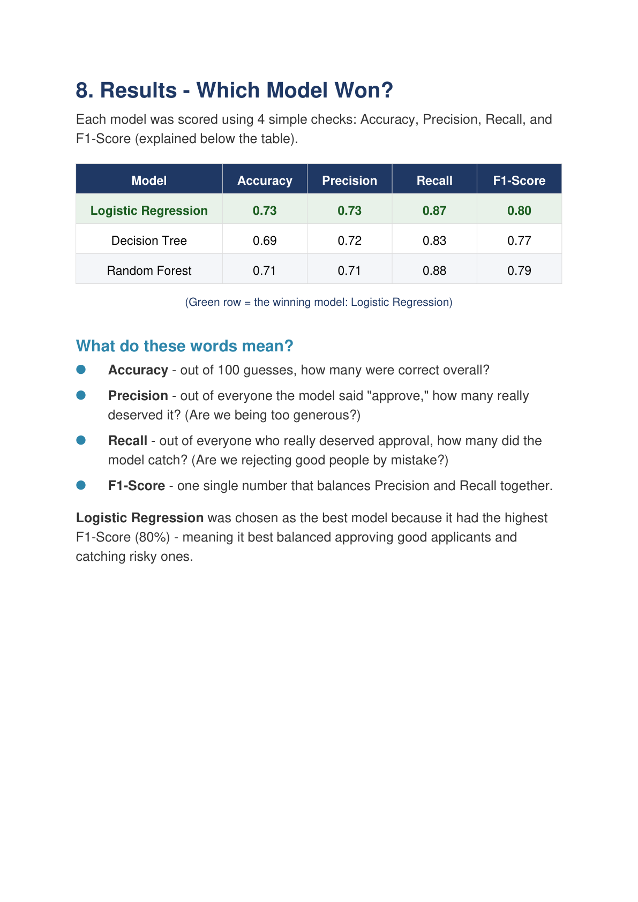
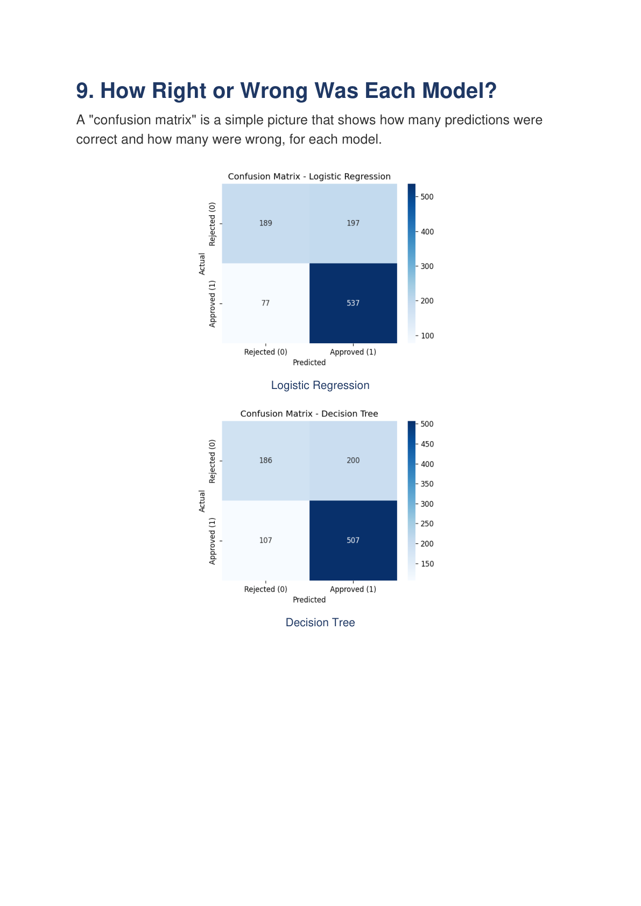

# Loan Approval Prediction System

A complete, production-style machine learning system that predicts whether a
loan application should be **approved** or **rejected**, based on applicant
income, credit history, employment status, loan amount, loan term, credit
score, and other risk factors. Built with Python, SQL, Pandas, Scikit-learn,
and a Power BI-ready dashboard dataset.



---

## Report Preview

> GitHub can't render `.pdf` files inline, so here's a preview.
> Full file: [PDF report](outputs/Loan_Approval_Prediction_System_Overview.pdf)

<p float="left">
  
  
  
</p>

---

## 1. Project Structure

```
loan-approval-prediction-system/
├── data/
│   ├── raw/
│   │   ├── loan_data.csv                # generated sample dataset (5,000+ applicants)
│   │   └── new_applicants_sample.csv    # example new applicants for scoring
│   ├── processed/
│   │   ├── loan_data_cleaned.csv        # after cleaning/missing-value handling
│   │   └── loan_data_features.csv       # after feature engineering (model-ready)
│   └── powerbi/
│       └── loan_dashboard_data.csv      # flat file for Power BI import
├── database/
│   ├── create_db.sql                    # schema (applicants, credit_profile, loan_details)
│   └── queries.sql                      # extraction / filtering / joins / aggregation
├── src/
│   ├── config.py                        # central paths & column definitions
│   ├── generate_sample_data.py          # synthetic dataset generator
│   ├── data_preprocessing.py            # cleaning & missing-value handling
│   ├── load_to_sql.py                   # loads cleaned data into SQLite
│   ├── feature_engineering.py           # derived features + encoding
│   ├── model_evaluation.py              # metrics, confusion matrices, reports
│   ├── train_models.py                  # trains & compares LogReg/DT/RF
│   ├── loan_decision.py                 # approved amount sizing + rejection reasons
│   ├── predict.py                       # scores new applicants (decision + amount + reason)
│   └── generate_powerbi_data.py         # builds the Power BI dataset
├── models/
│   ├── best_model.pkl                   # trained, deployment-ready model
│   ├── preprocessor.pkl                 # fitted feature transformer
│   ├── impute_values.json               # saved imputation values
│   └── model_metadata.json              # best model name, metrics, feature list
├── outputs/
│   ├── model_comparison.csv             # accuracy/precision/recall/F1 per model
│   ├── evaluation_report.txt            # full text evaluation report
│   ├── new_predictions.csv              # predictions for sample new applicants
│   └── confusion_matrices/              # PNG confusion matrix per model
├── scripts/
│   └── run_pipeline.py                  # runs the entire pipeline end to end
├── requirements.txt
└── README.md
```

---

## 2. Setup

**Prerequisites:** Python 3.10+ (tested on 3.13), pip.

```bash
# 1. Create and activate a virtual environment (recommended)
python -m venv .venv
.venv\Scripts\activate            # Windows
source .venv/bin/activate         # macOS/Linux

# 2. Install dependencies
pip install -r requirements.txt
```

No external database server is required — the project uses SQLite
(built into Python's standard library) so `database/loan_approval.db` is
created automatically.

---

## 3. Running the Project

### Option A — Run the entire pipeline in one command

```bash
python scripts/run_pipeline.py
```

This runs, in order: sample data generation → cleaning → SQL load →
feature engineering → model training/comparison → sample predictions →
Power BI dataset generation. Takes well under a minute on a laptop.

### Option B — Run each stage individually

```bash
python src/generate_sample_data.py     # create data/raw/loan_data.csv
python src/data_preprocessing.py       # clean data -> data/processed/loan_data_cleaned.csv
python src/load_to_sql.py              # build SQLite DB + run demo SQL queries
python src/feature_engineering.py      # engineer features -> data/processed/loan_data_features.csv
python src/train_models.py             # train/compare models, save best model
python src/predict.py                  # score data/raw/new_applicants_sample.csv
python src/generate_powerbi_data.py    # build data/powerbi/loan_dashboard_data.csv
```

### Scoring your own applicants

```bash
python src/predict.py --input path/to/your_applicants.csv --output outputs/your_predictions.csv
```

The input CSV must use the same columns as `data/raw/loan_data.csv`
(everything except `Loan_Status`).

Each applicant gets a full loan decision, not just approve/reject:

| Field | Meaning |
|---|---|
| `Final_Decision` | `Approved` / `Partially Approved` / `Rejected` |
| `Approved_Amount_INR` | Amount approved, in rupees (may be less than requested) |
| `Max_Eligible_Amount_INR` | Max the applicant can afford, in rupees, based on income/credit/existing loans |
| `Decision_Reason` | Why the amount was reduced, or why the application was rejected |

The ML model (`best_model.pkl`) predicts creditworthiness (approve/reject).
`src/loan_decision.py` then sizes the approved amount with an
affordability rule (reverse-EMI on a share of income that scales with
credit band, reduced for existing loan obligations), and generates
plain-language rejection reasons (poor/no credit history, low credit
score, high debt-to-income ratio, insufficient income relative to the
requested EMI, unemployment, too many existing loans, or requested amount
exceeding what's affordable). If the affordable amount is far below what
was requested, the decision flips to `Rejected` rather than approving a
token amount.

### Exploring the SQL layer directly

```bash
sqlite3 database/loan_approval.db
.read database/queries.sql
```

(or open `database/loan_approval.db` in any SQLite-compatible client / DB
Browser for SQLite and run the queries in `database/queries.sql`.)

### Generating the presentation

```bash
python scripts/generate_ppt.py
```

Builds `outputs/Loan_Approval_Prediction_System.pptx` — a 17-slide deck
(overview, pipeline, dataset, model comparison table/chart, confusion
matrices, decision logic, Power BI fields, business insights) using the
real numbers from the last `train_models.py` run. Re-run after retraining
to refresh the numbers.

### Generating the simple PDF overview

```bash
python scripts/generate_pdf.py
```

Builds `outputs/Loan_Approval_Prediction_System_Overview.pdf` — a 9-page,
plain-language overview covering what the project does, how it works,
the models compared, the results table, confusion matrices, the loan
decision logic, Power BI fields, and business insights. Written for a
non-technical reader; also uses the real numbers from the last training
run.

---

## 4. Machine Learning Approach

**Target:** `Loan_Status` (Approved / Rejected)

**Models trained and compared:**
| Model | Notes |
|---|---|
| Logistic Regression | Fast, interpretable baseline |
| Decision Tree | Captures non-linear rules, easy to explain to underwriters |
| Random Forest | Ensemble of trees, typically the strongest performer |

**Evaluation metrics:** Accuracy, Precision, Recall, F1-score, and a
Confusion Matrix per model (saved as PNGs in `outputs/confusion_matrices/`).

**Best model selection:** the model with the highest **F1-score** on the
held-out test set is automatically selected, saved to
`models/best_model.pkl`, and documented in `models/model_metadata.json`.
F1 is used (rather than raw accuracy) because loan decisions need a balance
between approving good applicants (recall) and avoiding bad-debt approvals
(precision).

Run `python src/train_models.py` and check `outputs/evaluation_report.txt`
for the full breakdown, or `outputs/model_comparison.csv` for a compact
side-by-side table.

---

## 5. Feature Engineering

Built on top of the cleaned raw fields:

* **Total_Income** — applicant + co-applicant income
* **Income_To_Loan_Ratio** — total income relative to loan principal
* **EMI** — estimated monthly installment (amortized at a notional rate)
* **Balance_Income** — monthly income remaining after the EMI is paid
* **Debt_To_Income_Ratio** — existing obligations relative to income
* **Risk_Category** — business-rule label (Low / Medium / High Risk) driven
  by credit score, credit history, DTI, and balance income — used for
  reporting, not fed into the model as a feature (to avoid circular logic)
* **Income_Bracket / Credit_Score_Band** — human-readable bins for dashboards

---

## 6. Power BI Dashboard

`data/powerbi/loan_dashboard_data.csv` is a single flat file, ready to load
directly into Power BI (**Get Data → Text/CSV**). Suggested visuals:

| Dashboard Field | Suggested Visual |
|---|---|
| Approval rate / Rejection rate | Card / Donut chart on `Loan_Status` |
| Risk category | Stacked bar of `Risk_Category` vs `Loan_Status` |
| Credit score analysis | Histogram of `Credit_Score`, sliced by `Credit_Score_Band` |
| Income analysis | Box plot / histogram of `Total_Income`, sliced by `Income_Bracket` |
| Loan amount trends | Line/bar of `LoanAmount` by `Property_Area` or `Employment_Status` |
| Applicant profile | Table/matrix of `Gender`, `Married`, `Education`, `Employment_Status`, `Property_Area` |
| Model performance | Compare `Loan_Status` (actual) vs `Predicted_Loan_Status` |
| Approved vs requested amount | `LoanAmount_INR` (requested) vs `Approved_Amount_INR` / `Max_Eligible_Amount_INR`, sliced by `Final_Decision` |

Recommended relationships/measures once imported:
* `Approval Rate = DIVIDE(COUNTROWS(FILTER(loan_dashboard_data, [Loan_Status]="Approved")), COUNTROWS(loan_dashboard_data))`
* `Rejection Rate = 1 - [Approval Rate]`

---

## 7. Business Insights & Project Outcome

Based on the modeling and SQL analysis performed on the sample dataset:

* **Credit history is the single strongest predictor of approval** —
  applicants with a poor/no credit history are approved at a dramatically
  lower rate regardless of income.
* **Debt-to-income ratio matters more than raw loan amount** — applicants
  with a high DTI are rejected even when requesting relatively small loans,
  since the loan becomes unaffordable relative to income.
* **Employment stability (years at current job, employment status)** adds
  meaningful lift beyond income alone — unemployed applicants have
  materially higher rejection rates even at similar income levels.
* **Random Forest generally outperforms the single Decision Tree and
  Logistic Regression baseline** on F1-score, since loan approval decisions
  involve non-linear interactions between credit, income, and debt factors
  that ensembles capture better than a linear model.

**Project outcome:** the system automates an initial risk screening step for
loan applications — flagging high-risk applicants early, giving loan
officers a consistent, auditable approval probability instead of ad-hoc
judgment, and producing a ready-to-use Power BI dataset so risk and
portfolio trends can be monitored without re-running the ML pipeline.

**How this reduces risk / speeds up decisions in practice:**
1. Auto-approve/auto-flag applications above/below confidence thresholds,
   reducing manual review volume.
2. Standardize risk categorization (Low/Medium/High) across all applicants
   for consistent underwriting policy.
3. Give portfolio managers a live view (via Power BI) of approval rates,
   risk mix, and income/credit trends to catch drift early.

---

## 8. Notes on the Sample Data

`data/raw/loan_data.csv` is **synthetically generated**
(`src/generate_sample_data.py`) from realistic distributions with an
underlying rule-based approval likelihood, plus injected missing values,
inconsistent text formatting, and a handful of duplicate records — so the
cleaning and feature engineering steps have genuine work to do. Swap in a
real applicant dataset with the same column names to use this pipeline in
production.
